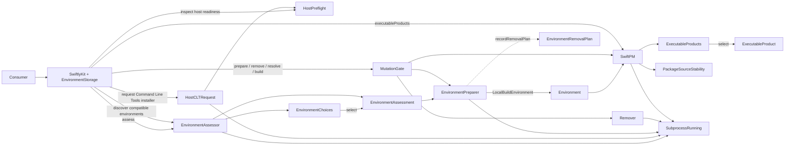

# SwiftlyKit architecture

SwiftlyKit exposes one public facade with a convenience API and a staged
workflow. Each facade captures one immutable `EnvironmentStorage` choice. Both
routes use the same internal workflow components:
`EnvironmentAssessor`, `EnvironmentPreparer`, `EnvironmentRemover`, and `SwiftPM`.

## Public workflows

The static convenience API, `SwiftlyKit.build`, creates a `SwiftlyKit` value with its
`environmentStorage` choice and runs the staged operations in order: assess,
prepare, discover products, select one, and build. If the build reports that
dependency resolution is required, the convenience API resolves once and retries
the build. It is orchestration over the staged interface, not a separate build
pipeline. Both paths accept the same optional `recordRemovalPlan` callback for
toolchain and SDK installation, and retain their natural throwing result types.

The staged API keeps authorization and build choices explicit. Assessment is
read-only: it captures the canonical package root and package-input bytes,
observes installed environment state, and retains the target and selected
official release and the facade's `EnvironmentStorage` namespace. Passing that
assessment to `prepare` authorizes only its `requiredComponents`. Preparation
returns the immutable `LocalBuildEnvironment` capability, including that
namespace, on success. If a caller supplies `recordRemovalPlan`, SwiftlyKit
calls it with a cumulative plan before each authorized toolchain or SDK
installation command.
The callback can persist that plan across failure, cancellation, and abrupt
termination. `BuildRequest` then contains only the choices for one product
build.

`EnvironmentRemovalPlan` describes an exact toolchain, SDK, or paired
environment scope together with its environment storage namespace. Plans can be
persisted and retried, but are not ownership or security tokens. `remove(_:)`
uses that namespace to observe live installed state, refuses active or default
toolchains and uninspectable SDK registry state, and preflights the complete
scope before issuing commands. Unrelated SDK registrations do not block an exact
removal. Full removal removes the SDK before its paired toolchain; absent
targets are no-ops. SwiftlyKit stays stateless: callers decide when to remove a
generated or explicitly constructed plan. Manual plan factories default to
`.standard` and accept a custom namespace through `in:`.
Manual SDK plans use only the exact registry identifier. Full-environment plans
carry both the exact toolchain version and SDK identifier; neither requires
release-catalog metadata.

Release-catalog observation is process-wide and single-flight. One validated
live result remains in memory for one hour and atomically replaces one raw,
disposable snapshot in the user's cache directory. A catalog network failure
can use that persistent snapshot only to assess a toolchain and matching SDK
that the same installed-state observation reports as complete. This fallback
cannot authorize installation. Cancellation and invalid live metadata never
fall back. The cache contains no package or credential data and does not defend
against a process that can modify files as the same user. Cache replacement does
not change package or installed environment state.

Compatible-environment discovery uses the same read-only observation and
materializes each exact compatible assessment once in newest-first order.
`EnvironmentChoices.select` applies automatic or exact policy to that captured
evidence without more I/O. The collection can remain useful for exact selection
if an invalid `.swift-version` makes automatic selection fail.

The static `hostReadiness` operation exposes the same read-only `HostPreflight`
result used by assessment, preparation, and recovery. It does not require a
package. The separate `requestCommandLineToolsInstallation` recovery operation
returns for a ready host, rejects an unsupported host, and invokes Apple's
`xcode-select --install` entry point only if developer tools are unavailable. It
returns when macOS accepts the request; it cannot observe license acceptance or
installation completion. The consumer retries readiness inspection or
assessment after the user finishes the system interaction.

For one macOS user, every production `SwiftlyKit` facade value and static
convenience API call that uses coordination protocol v1 admits at most one mutating
public operation at a time. One cancellation-aware `MutationGate` provides FIFO
admission inside one process. Before an admitted mutation starts, the gate opens
the stable user-scoped file at
`~/Library/Application Support/SwiftlyKit/Coordination/v1/mutation.lock` and
acquires an exclusive advisory `flock`. Each open normalizes the file to
user-only permissions. The file remains in place between operations and is never
removed or replaced. A persistent inode prevents two cooperating processes from
locking different files during release and acquisition.

Lock acquisition uses nonblocking attempts and an asynchronous polling interval
so a waiting task remains cancellable. The descriptor uses `O_CLOEXEC`, which
prevents delegated tools from retaining the lease after process execution. The
gate unlocks and closes the descriptor on success, failure, or cancellation. If
the owner terminates, the kernel closes its descriptor and releases the lock;
the persistent file is not stale state and must not be deleted for recovery.
Failure to prepare or open the lock produces `mutationCoordinationFailed`.
Reentrant mutation through the same asynchronous task context also produces
`mutationCoordinationFailed` instead of waiting for its own active lease. A
detached task does not inherit that context. An awaited event handler or removal
plan recorder must not await another mutating SwiftlyKit operation, directly or
through detached work.

The lease is deliberately user-wide even when a facade selects a custom
environment storage root. Standard and custom environment namespaces therefore
cannot be mutated concurrently by cooperating SwiftlyKit processes for the same
user.

Preparation, removal, dependency resolution, builds, and explicit cleanup each hold one
lease for their complete public operation. The static convenience API holds one lease
across assessment, preparation, product discovery, dependency resolution, build,
parent-side inspection, optional stripping, output publication, and requested
cleanup. Its private under-lease mechanics do not reacquire the gate. Another
consumer can run between staged calls.

Read-only assessment and product discovery remain concurrent. Their installed
inventory can change while it is observed or before the result is used, so the
results are not transactional snapshots. Preparation reinspects installed state
and revalidates captured package selection inputs before it mutates anything.

The Command Line Tools installation request does not use this coordinator. It
starts machine-level system interaction and returns before installation
finishes, so concurrent consumers can submit duplicate requests.

The lock is intentionally user-wide instead of resource-keyed. Preparation can
change shared Swiftly, toolchain, and SDK state, and one lock avoids canonical
resource identities and multi-lock ordering. It conservatively serializes
mutations that use disjoint packages and scratch directories. Resource-keyed
coordination is an optimization to consider only if measured contention earns
the added interface and deadlock risk.

The kernel lock is advisory. It coordinates cooperating SwiftlyKit processes for
the same user environment, but an independently launched `swift` or `swiftly`
command and direct filesystem mutation do not acquire it. SwiftPM has its own
scratch-directory lock, and Swiftly 1.1.3 has a separate install/uninstall lock;
neither spans SwiftlyKit's complete workflow. Consumers that mix those direct
operations with SwiftlyKit must serialize them at a higher level or keep their
state disjoint.

The lease does not freeze package sources. `PackageSourceStability` provides a
separate build-scoped guarantee. SwiftPM first returns the complete resolved
package graph without automatic resolution. SwiftlyKit starts recursive FSEvents
observation, captures deterministic source evidence, compiles, discovers and
verifies the selected executable and its exact linked runtime resources,
captures the evidence again, and drains the event stream. A lasting
change, a reverted change, an unreliable event stream, or a failed capture
withholds the result. The selected scratch directory and each source root's
top-level `.build`, `.git`, and `.swiftpm` entries are excluded, but resolved
dependency roots nested inside scratch override that exclusion. Observation
finishes before executable stripping, output publication, or cleanup. Those
steps read build output, not package source.

Source evidence covers paths, bytes, executable permissions, and safe symbolic-
link destinations across the root package and resolved local or checkout
dependencies. This includes `Package.swift` and `Package.resolved`. The module
ignores clone-only APFS source notifications that SwiftPM resource copying
emits. A clone notification with any mutation flag still records a change. The
final deterministic snapshot also verifies the source bytes and metadata.
The module does not build from an immutable copy, retain fingerprints, or create
durable artifact provenance.

Abrupt owner termination can also leave an already launched tool process alive.
`O_CLOEXEC` ensures that child does not retain SwiftlyKit's lease, which provides
deterministic crash recovery but cannot prove that the orphan stopped mutating
external state. A consumer that knows an external tool survived must stop it or
wait for it before retrying. Durable orphan detection and coordination with
unmodified external tools remain outside the current interface.

Design references: Apple's [`flock(2)` manual](https://developer.apple.com/library/archive/documentation/System/Conceptual/ManPages_iPhoneOS/man2/flock.2.html)
defines the advisory, kernel-owned behavior; Apple documents
[`O_CLOEXEC`](https://developer.apple.com/documentation/system/filedescriptor/pipeoptions/closeonexec);
SwiftPM uses an exclusive scratch-directory lock in
[`SwiftCommandState`](https://github.com/swiftlang/swift-package-manager/blob/222d17bc672b283dd4b846d12322085c5d3ff753/Sources/CoreCommands/SwiftCommandState.swift#L1253-L1336);
and Swiftly 1.1.3 limits its independent lock to
[`install`](https://github.com/swiftlang/swiftly/blob/8e759540b22a1d58e592da96b7c1de058c360a8f/Sources/Swiftly/Install.swift#L370-L390)
and [`uninstall`](https://github.com/swiftlang/swiftly/blob/8e759540b22a1d58e592da96b7c1de058c360a8f/Sources/Swiftly/Uninstall.swift#L140-L155).

## Implementation map

- `SwiftlyKit.swift` is the public facade, convenience API orchestrator, and interface
  that maps internal failures to `SwiftlyKitError`.
- `MutationGate.swift` combines process-local FIFO admission with a persistent
  user-scoped advisory file lock for complete public mutating workflows.
- `Environment/Host` represents host readiness explicitly, lets readiness-required
  operations reject unsupported hosts or missing developer tools before other
  work proceeds, and owns the adapter that requests Apple's interactive Command
  Line Tools installer.
- `Environment/Assessment` owns `PackageInputSnapshot`, which canonicalizes the
  package root, parses the tools version, finds the nearest `.swift-version`, and
  snapshots those inputs byte-for-byte. It coordinates the read-only package,
  host, release, discovery, and selection steps and produces one
  `EnvironmentAssessment` or an `EnvironmentChoices` snapshot.
- `Environment/Discovery` resolves the selected `EnvironmentStorage` namespace,
  detects Swiftly and the SDK registry there without ambient `SWIFTLY_*`
  overrides, constructs Swiftly-run commands, and owns the filtered
  `InstalledEnvironmentInventory` used by normal environment selection. Removal
  also uses a separate raw registered-SDK safety view so unrelated SDK
  identifiers are never discarded during destructive preflight.
- `Environment/Selection` deterministically selects one exact official stable
  release and matching SDK, preferring a compatible installed pair for automatic
  selection. It also coalesces live catalog requests and owns the bounded,
  private, disposable release-catalog snapshot.
- `Environment/Preparation` revalidates the assessment, performs only authorized
  installations in the captured namespace, refreshes installed inventory after
  mutations, and returns the prepared local build environment. Standard
  bootstrap uses the normal current-user installation. Custom bootstrap keeps
  the verified package extraction and population path inside the selected
  namespace without replacing the standard installation. Preparation can send
  conservative, namespace-aware removal plans to a caller-supplied recorder
  before toolchain or SDK installation.
- `Environment/Removal` observes raw registered Swiftly state in the plan's
  namespace, performs complete safety preflight, removes exact SDK/toolchain
  targets, and verifies each postcondition. It never removes Swiftly itself.
- `Environment/EnvironmentStorage` validates the standard or dedicated custom
  root, derives its Swiftly home, binary, toolchain, and SDK registry locations,
  and carries that namespace through assessment, preparation, selected-tool
  commands, and removal.
- `Environment/SwiftPMEnvironment`, `Environment/SwiftPMTraits`, and
  `Environment/SwiftPMSharedStorage` validate and normalize workflow-scoped
  SwiftPM process, package-graph, and shared-storage configuration.
- `Build` contains the public build value types.
- `SwiftPM` validates a prepared capability and coordinates product discovery,
  explicit dependency resolution, build execution, optional stripping, and
  build-storage cleanup.
- `SwiftPM/PackageDescription` decodes SwiftPM package metadata into executable
  products. The facade wraps
  the name-ordered products in `ExecutableProducts`, which owns named and sole
  selection policy.
- `SwiftPM/Output` owns ELF verification, exact linked runtime-resource
  discovery, trusted-local resource-tree validation, staged executable
  transformation, and atomic complete-directory publication.
- `Filesystem` owns domain-independent canonical file identity and path-overlap
  comparison shared by environment and SwiftPM workflows.
- `SwiftPM/SourceStability` owns resolved-graph source discovery, deterministic
  snapshots, recursive event observation, and the
  build-scoped accept-or-withhold decision.
- `SwiftPM/Storage` converts a public `SwiftPMScratchStorage` choice into a
  canonical, safety-checked scratch directory and hides the retained exact-SDK
  directory layout and its cross-process create-or-verify protocol.
- `Subprocess` is the only adapter to `swift-subprocess`. Production uses
  `LiveSubprocessRunner`; tests use the same `SubprocessRunning` seam.
- `Events` contains the optional awaited progress and output interface. Command
  output from preparation and SwiftPM is converted through one shared adapter.

## Invariants

- Test seams and infrastructure are internal and cannot configure production
  callers.
- All production facade values and cooperating SwiftlyKit processes for one user
  share one mutation lease. Uncooperative tools do not share this invariant.
- The static convenience API holds one lease for its complete workflow. Staged
  mutations each hold one lease for the duration of that public call.
- The Command Line Tools installer is requested only through the explicit public
  recovery operation. It is not part of assessment or preparation, and success
  means only that macOS accepted the request.
- `HostReadiness` reports unsupported hosts and unavailable developer tools
  without package work. Operations that cannot continue translate those values
  to `SwiftlyKitError`; the installer requester branches on them directly.
- Assessment derives its values from one captured `Package.swift` and nearest
  `.swift-version` state and the facade's immutable `EnvironmentStorage` choice.
  Preparation compares the same inputs byte-for-byte before any mutation.
- `.standard` uses the official per-user Swiftly, toolchain, and SwiftPM SDK
  locations and ignores ambient `SWIFTLY_*` overrides. `.directory(root)`
  derives `root`, `root/bin`, `root/toolchains`, and `root/swift-sdks` and
  carries those paths through discovery, preparation, selected-tool command
  environments, and removal.
- A custom environment root must be an absolute, dedicated local directory. It
  is disjoint from package sources, the effective SwiftPM scratch directory,
  explicit SwiftPM shared storage, and publication destinations. SwiftlyKit may
  create and populate it, but never deletes it wholesale or removes Swiftly.
- Standard bootstrap uses the official current-user installation path. Custom
  bootstrap verifies the official downloaded package's signature and Apple
  trust, then uses a dedicated extraction path for the selected namespace; it
  does not overwrite the standard installation.
- Persistent release metadata is parsed with the live catalog parser and can
  recover assessment only for one exact pair that Swiftly reports as fully
  installed. It cannot authorize a download or installation. Cache failure is
  nonfatal after a valid live observation.
- Compatible environment choices are unique by Swift version, ordered newest
  first, and derived from one package, catalog, target, and installed-state
  observation. Selection from the snapshot performs no I/O.
- Preparation installs only components authorized by `requiredComponents` and
  confirms the selected toolchain and SDK before returning. Swiftly installer
  downloads require HTTPS and a successful response, the installer must pass
  signature and Apple-trust checks, and SDK installation uses the published
  checksum.
- Preparation calls the optional removal-plan recorder before each authorized
  toolchain or SDK mutation. The cumulative plan covers resources observed
  absent immediately before that attempt. The recorder is write-ahead, so a
  caller can recover the plan after ordinary failure, cancellation, or process
  termination; SwiftlyKit never removes resources automatically.
- Read-only assessment treats a missing custom SDK registry as empty and does
  not create it. Preparation can create it only after the assessment authorizes
  SDK installation.
- Removal-plan recorders and event handlers must not await another mutating
  SwiftlyKit operation, including removal, directly or through detached work.
- Environment removal uses exact stable versions and SDK identifiers, performs
  one complete preflight before the first destructive command, refuses active or
  default toolchains and uninspectable SDK registry state, removes only the exact
  requested SDK before its paired toolchain, verifies postconditions, and treats
  absent targets as success. Unrelated SDK registrations never block the exact
  request. Removal plans carry the environment storage namespace; manual
  factories default to `.standard` and accept a namespace through `in:`.
- Normal selection uses one filtered canonical inventory. Removal intentionally
  uses a separate exact raw safety view that preserves every SDK identifier and
  selection flag; automatic selection never allows installed state to replace
  the selected official release metadata.
- `StaticLinuxSDK` carries the catalog identity and release version used for
  preparation. Removal plans use the exact SDK identifier and carry a toolchain
  version only for full-environment removal because one SDK registry is shared
  by the toolchains in an environment namespace.
- Public SwiftPM package inspection, dependency resolution, and build operations
  revalidate the package tools version, Swiftly executable, and exact SDK bundle
  of their `LocalBuildEnvironment`. Standalone build-storage cleanup deliberately
  skips package and SDK validation so it remains available as a recovery
  operation when that state is stale or unavailable. Cleanup after a validated
  build does not redundantly revalidate the environment.
- SwiftPM command construction always selects the prepared toolchain and exposes
  only the prepared SDK through a deterministic, isolated SDK search directory
  retained inside the effective build scratch directory. The prepared SwiftPM
  environment cannot replace protected host, Swiftly, compiler, or SDK values.
- One immutable trait configuration reaches package inspection, resolved-graph
  discovery, explicit resolution, build, bin-path lookup, clean, and reset. Its
  arguments never reach Swiftly or selected non-SwiftPM tools.
- One immutable shared-storage configuration reaches the same SwiftPM commands.
  Explicit cache, configuration, and security directories remain caller-owned;
  SwiftlyKit cleanup removes only selected scratch storage. Standard locations
  remain implicit, and shared-storage arguments never reach Swiftly or selected
  non-SwiftPM tools.
- `EnvironmentStorage` controls durable Swiftly state, binaries, toolchains,
  and Static Linux SDKs. SwiftPM scratch and shared storage remain separate
  choices; the feature does not create a private `HOME` or full process sandbox.
- SDK selection resolves only after the retained directory is verified. If
  another process wins atomic link creation, SwiftlyKit verifies and reuses that
  exact selection; conflicting filesystem state is never accepted.
- Product discovery and builds disable automatic dependency resolution. Staged
  builds surface a structured resolution-required error; only the convenience API
  performs the explicit resolve-and-retry sequence. Staged resolution accepts
  its own scratch selection, while the convenience API reuses its build scratch.
- Executable products are unique and ordered by name. Named and sole-product
  selection use the same `ExecutableProducts.select` behavior in staged and
  convenience workflows.
- Internal SwiftPM failures are classified structurally before becoming public
  `SwiftlyKitError` values. Collected subprocess output and surfaced diagnostics
  are bounded.
- A public `BuildResult` identifies the final executable, its exact verified
  runtime resource bundles in stable name order, and their computed common
  directory. The executable must be a static, little-endian ELF64 file for the
  requested architecture. Stripped results are verified again.
- Runtime resource ownership comes only from the selected product's final link
  file and the linked modules' generated resource accessors. Unrelated stale
  sibling bundles are ignored. Missing, escaping, symbolic-link, malformed, or
  ambiguous metadata fails closed.
- Private link and accessor inspection starts only when the binary directory
  contains a `.resources` candidate. With no candidates, the output is treated
  as resource-free. Detecting removal of every linked bundle would require
  private-layout inspection for every resource-free build.
- A selected runtime bundle is an immediate, uniquely named `.resources`
  directory beside the executable. Its trusted-local tree contains only regular
  files and directories, with no symbolic links, hard links, or special files.
- A successful build has unchanged source evidence across the complete resolved
  package graph from its initial snapshot through compilation and complete
  build-output discovery and verification. A reverted mutation also rejects the
  result.
- Stripping operates only on a SwiftlyKit-owned executable and never changes
  SwiftPM's produced executable or runtime resources in build storage.
- Build-storage output returns a `BuildResult` with required resource bundles as
  siblings. Its directory can contain unrelated SwiftPM output. The executable
  is not portable by itself, and callers use the result's exact resource list
  rather than enumerating the directory.
- Requested output publication stages beside the destination and publishes one
  complete directory with one executable and only its exact linked bundles. An
  exclusive rename provides create-only publication. A rename swap provides
  atomic replacement of an existing nonempty destination before the prior tree
  is removed. A caller moves or deploys this directory as one unit.
- Cleanup starts only after successful publication. If cleanup fails, the
  published directory remains and the error identifies that directory.
- SwiftPM provides no stable runtime-resource enumeration interface. The output
  module deliberately couples to the observed link-file and generated-accessor
  layout in one place and fails closed if that private layout changes while
  resource candidates exist.
