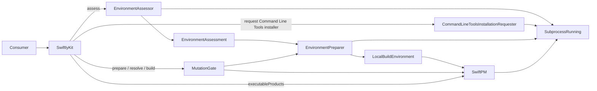

# SwiftlyKit architecture

SwiftlyKit exposes one public facade with a convenience fast track and a staged
workflow. Both routes use the same three internal workflow components:
`EnvironmentAssessor`, `EnvironmentPreparer`, and `SwiftPM`.

## Public workflows

The static `SwiftlyKit.build` fast track creates a `SwiftlyKit` value and runs the
staged operations in order: assess, prepare, discover products, select one, and
build. If the build reports that dependency resolution is required, the fast
track resolves once and retries the build. It is orchestration over the staged
API, not a separate build pipeline.

The staged API keeps authorization and build choices explicit. Assessment is
read-only: it captures the canonical package root and package-input bytes,
observes installed environment state, and retains the target and selected
official release. Passing that assessment to `prepare` authorizes only its
`requiredComponents`. Preparation returns an immutable `LocalBuildEnvironment`
capability containing the exact package, target, Swiftly executable, toolchain,
and SDK context used by later operations. `BuildRequest` then contains only
choices for one build.

The static `requestCommandLineToolsInstallation` recovery operation is separate
from environment preparation. It first reuses host preflight as an idempotency
check, then invokes Apple's `xcode-select --install` entry point only when a
usable SDK is unavailable. It returns when macOS accepts the request; it cannot
observe license acceptance or installation completion. The consumer retries
assessment after the user finishes the system interaction.

Each `SwiftlyKit` facade instance owns a cancellation-aware FIFO `MutationGate`.
Preparation, dependency resolution, and builds acquire the gate because they can
change user, package, scratch, or output state. Read-only assessment and product
discovery do not acquire it.

## Implementation map

- `SwiftlyKit.swift` is the public facade, fast-track orchestrator, and boundary
  that maps internal failures to `SwiftlyKitError`.
- `MutationGate.swift` serializes the mutating operations of one facade value.
- `Package` canonicalizes the package root, parses the tools version, finds the
  nearest `.swift-version`, and snapshots the input files byte-for-byte.
- `Environment/Host` rejects unsupported hosts and missing developer tools
  before environment work proceeds, and owns the explicit adapter that requests
  Apple's interactive Command Line Tools installer.
- `Environment/Assessment` coordinates the read-only package, host, release,
  discovery, and selection steps and produces `EnvironmentAssessment`.
- `Environment/Discovery` detects Swiftly, constructs Swiftly-run commands, and
  owns `InstalledEnvironmentInventory`, the canonical installed toolchain and
  SDK representation.
- `Environment/Selection` deterministically selects one exact official stable
  release and matching SDK, preferring a compatible installed pair for automatic
  selection.
- `Environment/Preparation` revalidates the assessment, performs only authorized
  installations, refreshes installed inventory after mutations, and returns the
  prepared capability.
- `Build` contains the public build value types. `Build/SwiftPM` validates a
  prepared capability and owns product discovery, explicit dependency
  resolution, build execution, resource rejection, ELF verification, optional
  stripping, and atomic publication.
- `Process` is the only adapter to `swift-subprocess`. Production uses
  `LiveSubprocessRunner`; tests use the same `SubprocessRunning` seam.
- `Events` contains the optional awaited progress and output interface. Command
  output from preparation and SwiftPM is converted through one shared adapter.

## Invariants

- Test seams and infrastructure are internal and cannot configure production
  callers.
- The Command Line Tools installer is requested only through the explicit public
  recovery operation. It is not part of assessment or preparation, and success
  means only that macOS accepted the request.
- Assessment derives its values from one captured `Package.swift` and nearest
  `.swift-version` state. Preparation compares the same inputs byte-for-byte
  before any mutation.
- Preparation installs only components authorized by `requiredComponents` and
  confirms the selected toolchain and SDK before returning. Swiftly installer
  downloads require HTTPS and a successful response, the installer must pass
  signature and Apple-trust checks, and SDK installation uses the published
  checksum.
- Installed state has one canonical inventory representation. Automatic
  selection considers the inventory without allowing installed state to replace
  the selected official release metadata.
- Every SwiftPM operation revalidates the package tools version, Swiftly
  executable, and exact SDK bundle of its `LocalBuildEnvironment`.
- SwiftPM command construction always selects the prepared toolchain and exposes
  only the prepared SDK through a deterministic, isolated SDK search directory
  retained inside the effective build scratch directory. Caller build environment
  additions cannot replace protected home or Swiftly variables.
- Product discovery and builds disable automatic dependency resolution. Staged
  builds surface a structured resolution-required error; only the fast track
  performs the explicit resolve-and-retry sequence.
- Internal SwiftPM failures are classified structurally before becoming public
  `SwiftlyKitError` values. Collected subprocess output and surfaced diagnostics
  are bounded.
- A build result must be an executable, static, little-endian ELF64 file for the
  requested architecture. Stripped results are verified again.
- Output publication uses an exclusive atomic rename and never replaces an
  existing destination.
