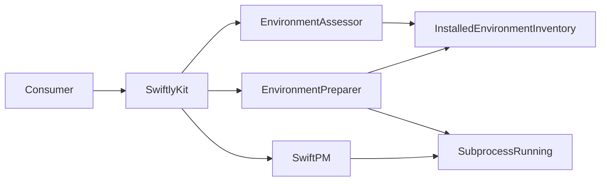

# SwiftlyKit architecture

SwiftlyKit has one public entrypoint and three internal workflow modules.

## Public workflow

`SwiftlyKit.swift` contains the complete task-oriented interface. Assessment
establishes the package and target. Internally, the assessment retains one exact
package-input snapshot and selected official release; its public availability
properties are derived from the required installations. Preparation turns the
accepted assessment into a `LocalBuildEnvironment`, an immutable capability that
retains the exact package, target, Swiftly executable, toolchain, and SDK required
by later calls.

Callers therefore provide package and target identity once. `BuildRequest`
contains only choices specific to one build.

## Implementation map

- `Environment/Assessment` owns read-only orchestration and produces an
  `EnvironmentAssessment`.
- `Environment/Discovery` owns Swiftly discovery and the single authoritative
  representation of installed toolchains and SDKs.
- `Environment/Selection` owns pure deterministic release selection.
- `Environment/Preparation` owns authorized mutation and returns a prepared
  capability.
- `Build/SwiftPM` owns product discovery, dependency resolution, build execution,
  ELF verification, stripping, and atomic publication.
- `Process` is the only adapter to `swift-subprocess`. Production uses
  `LiveSubprocessRunner`; tests use one recording adapter through the same seam.
- `Package` reads the text-only package inputs needed before manifest evaluation.
- `Events` contains the optional awaited progress and output interface.

`SwiftlyKit` owns the mutation gate because serialization is an instance-level
promise spanning both preparation and builds. Read-only assessment and product
discovery do not acquire it.

## Invariants

- Test infrastructure is internal and cannot configure production callers.
- Environment preparation performs only mutations authorized by its assessment.
- Package inputs are compared byte-for-byte before preparation.
- Assessment values are derived from one captured package state and selected release.
- Installed Swiftly state is parsed once into `InstalledEnvironmentInventory`.
- Internal SwiftPM failures are classified structurally before becoming
  `SwiftlyKitError` values.
- Build subprocesses receive the exact prepared toolchain and SDK identity.
- Output publication never replaces an existing destination.
